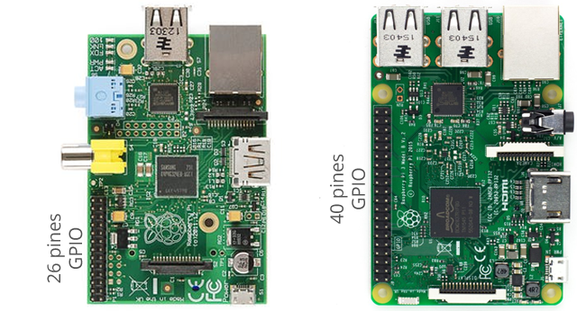

Raspberry Pi
La Raspberry Pi es una serie de ordenadores de placa reducida, ordenadores de placa única u ordenadores de placa simple (SBC) de bajo costo desarrollado en el Reino Unido por la Raspberry Pi Foundation, con el objetivo de poner en manos de las personas de todo el mundo el poder de la informática y la creación digital.

GPIO
General Purpose Input Output (GPIO) es un sistema de entrada y salida de propósito general, es decir, consta de una serie de pines o conexiones que se pueden usar como entradas o salidas para múltiples usos. Estos pines están incluidos en todos los modelos de Raspberry Pi aunque con diferencias.

